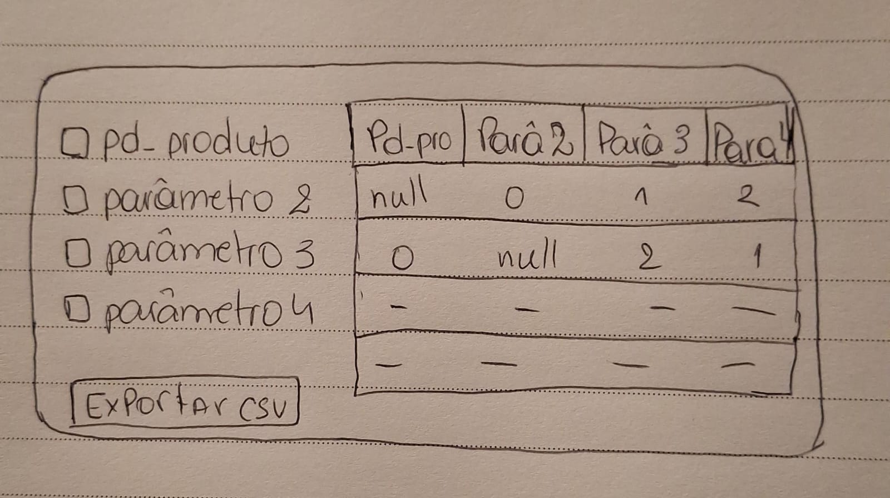
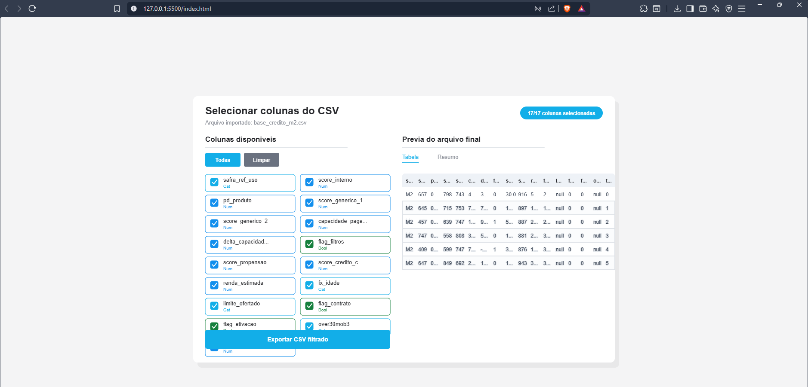

# Microinterface p5.js

## 1. Introdução

Esta microinterface representa apenas uma parte de uma tela maior: o momento em que uma base de crédito já foi importada em CSV e o usuário precisa escolher quais colunas farão parte do arquivo final.

A utilidade para o usuário está em permitir que ele confira rapidamente o conteúdo do CSV, marque ou desmarque colunas e exporte uma versão filtrada. Isso evita remover colunas manualmente em planilhas.

## 2. Rascunho inicial

## 3. Registro do resultado obtido

A microinterface é útil porque foca em uma tarefa específica e frequente: decidir quais campos de uma base devem ser exportados. O componente ajuda o usuário a controlar os dados de entrada, visualizar o resultado antes da exportação e gerar um arquivo mais limpo.

Como usar:

1. Abra `index.html` no navegador.
2. Marque ou desmarque as colunas desejadas.
3. Confira a prévia em `Tabela` ou `Resumo`.
4. Clique em `Exportar CSV filtrado`.
